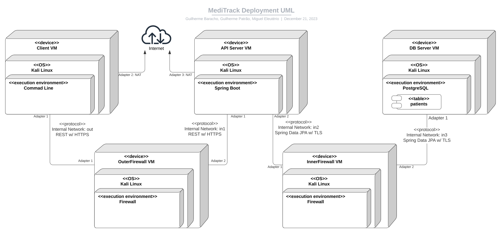

# Network and Computer Security Project - MEIC @ IST - 2023/2024

Group project for the "Network and Computer Security" class @ Instituto Superior Técnico, Lisbon 2023/2024

## Team

Group consists of 3 members.

Code by Guilherme Patrão & Guilherme Baracho & Miguel Eleutério.[^1][^2]

[^1]: This is not the original repository, hence why there are 2 contributors missing and therefore not all files here had my involvement. 
[^2]: The original repository is private as it contains private information that cannot be disclosed publicly due to confidentiality matters.

## Contents

This repository contains documentation and source code for the *Network and Computer Security (SIRS)* project.

The [REPORT](REPORT.md) document provides a detailed overview of the key technical decisions and various components of the implemented project.
It offers insights into the rationale behind these choices, the project's architecture, and the impact of these decisions on the overall functionality and performance of the system.

This document presents installation and demonstration instructions.

## Installation

To see the project in action, it is necessary to setup a virtual environment, with 4 networks and 5 machines.  

The following diagram shows the networks and machines:



### Prerequisites

All the virtual machines are based on: Linux 64-bit, Kali Linux.  

Setup the base Kali Linux virtual machine following this [tutorial](https://github.com/tecnico-sec/Setup/). This machine represents SysAdmin's machine.

Clone the repository to the base machine. We will use the repository's configs folder as a representation of a usb drive prepared by the SysAdmin:

```sh
git clone git@github.com:tecnico-sec/a06-miguel-guilherme-guilherme.git
```

Go into the config folder and generate the asymetric keys for the different users of the system:

```sh
cd a06-miguel-guilherme-guilherme/configs
java GenAsymKeys.java
```

Clone the base machine to create the 5 machines following the diagram above.

### Machine configurations

For each machine, there is an initialization script with the machine name, with prefix `init-` and suffix `.sh`, that installs all the necessary packages and makes all required configurations in the clean machine.

All `init` scripts need to be ran from within the `configs` folder on the project repository.

Next we have custom instructions for each machine.

#### Client

This machine runs the client application of our solution. 

When you run the `init-client.sh` script you'll be prompted for the name of the user to whom the client machine "belongs" to.

```sh
bash init-client.sh
``` 
Output
```sh
$ Inser client name (doctor or patient name):
$
``` 

For demonstration purposes, you can login as 7 different users:
- Doctors
    - dr_jordan
    - dr_anne
    - dr_steve
- Patients
    - trevor
    - jack
    - nina
- Emergengy Access
    - emergency


Reboot the system to apply changes.

To verify the network setup:
```sh
ifconfig
```
This should be the output:
```sh
eth0: flags=4163<UP,BROADCAST,RUNNING,MULTICAST>  mtu 1500
        inet 192.168.0.123  netmask 255.255.255.0  broadcast 192.168.0.255
        ...
eth1: flags=4163<UP,BROADCAST,RUNNING,MULTICAST>  mtu 1500
        inet 10.0.3.15  netmask 255.255.255.0  broadcast 10.0.3.255
        ...
```
There needs to be a connection to the actual internet so that any dependencies for the application can be downloaded if needed. The IP for the NAT interface might be different since it is a dynamic IP.

To verify the keys:
```sh
ls ~/meditrack
ls ~/meditrack/publicKeys
```
This should be the output:
```sh
<name>.priv  publicKeys
dr_anne.pub  dr_jordan.pub  dr_steve.pub  emergency.pub  jack.pub  nina.pub  trevor.pub
```
With `name` being the name provided on the prompt.

#### OuterFirewall

This machine runs the firewall and the NAT between the CLient and the API Server. 

To setup run:
```sh
bash init-outFW.sh
``` 

Reboot the system to apply changes.

To verify the network setup:
```sh
ifconfig
```
This should be the output:
```sh
eth0: flags=4163<UP,BROADCAST,RUNNING,MULTICAST>  mtu 1500
        inet 192.168.0.186  netmask 255.255.255.0  broadcast 192.168.0.255
        ...
eth1: flags=4163<UP,BROADCAST,RUNNING,MULTICAST>  mtu 1500
        inet 192.168.1.155  netmask 255.255.255.0  broadcast 192.168.1.255
        ...
```

To verify the Nat rules:
```sh
sudo iptables -L -t nat
```
This should be the output:
```sh
Chain PREROUTING (policy ACCEPT)
target     prot opt source               destination         
DNAT       tcp  --  anywhere             anywhere             tcp dpt:tproxy to:192.168.1.195:8081
...
Chain POSTROUTING (policy ACCEPT)
target     prot opt source               destination         
MASQUERADE  all  --  anywhere             anywhere 
```

To verify the Firewall rules:
```sh
sudo iptables -L
```
This should be the output:
```sh
Chain INPUT (policy DROP)
target     prot opt source               destination         

Chain FORWARD (policy DROP)
target     prot opt source               destination         
ACCEPT     tcp  --  anywhere             anywhere             tcp dpt:tproxy
ACCEPT     tcp  --  anywhere             anywhere             tcp spt:tproxy

Chain OUTPUT (policy DROP)
target     prot opt source               destination
```


#### API Server

This machine runs the API server (Spring Boot 3.2.0). 

To setup run:
```sh
bash init-api.sh
``` 

Reboot the system to apply changes.

To verify the network setup:
```sh
ifconfig
```
This should be the output:
```sh
eth0: flags=4163<UP,BROADCAST,RUNNING,MULTICAST>  mtu 1500
        inet 192.168.1.195  netmask 255.255.255.0  broadcast 192.168.1.255
        ...
eth1: flags=4163<UP,BROADCAST,RUNNING,MULTICAST>  mtu 1500
        inet 192.168.2.35  netmask 255.255.255.0  broadcast 192.168.2.255
        ...
eth2: flags=4163<UP,BROADCAST,RUNNING,MULTICAST>  mtu 1500
        inet 10.0.4.15  netmask 255.255.255.0  broadcast 10.0.4.255
```
There needs to be a connection to the actual internet so that any dependencies for the application can be downloaded if needed. The IP for the NAT interface might be diferent since it is a dynamic IP.

To verify the keys:
```sh
ls ~/meditrack
ls ~/meditrack/publicKeys
```
This should be the output:
```sh
emergency.priv  publicKeys
dr_anne.pub  dr_jordan.pub  dr_steve.pub  emergency.pub  jack.pub  nina.pub  trevor.pub
```

#### InnerFirewall

This machine runs the firewall and the NAT between the API Server and the DB Server. 

To setup run:
```sh
bash init-inFW.sh
``` 

Reboot the system to apply changes.

To verify the network setup:
```sh
ifconfig
```
This should be the output:
```sh
eth0: flags=4163<UP,BROADCAST,RUNNING,MULTICAST>  mtu 1500
        inet 192.168.2.7  netmask 255.255.255.0  broadcast 192.168.2.255
        ...
eth1: flags=4163<UP,BROADCAST,RUNNING,MULTICAST>  mtu 1500
        inet 192.168.3.89  netmask 255.255.255.0  broadcast 192.168.3.255
        ...
```

To verify the Nat rules:
```sh
sudo iptables -L -t nat
```
This should be the output:
```sh
Chain PREROUTING (policy ACCEPT)
target     prot opt source               destination         
DNAT       tcp  --  anywhere             anywhere             tcp dpt:tproxy to:192.168.3.210:5432
...
Chain POSTROUTING (policy ACCEPT)
target     prot opt source               destination         
MASQUERADE  all  --  anywhere             anywhere
```

To verify the Firewall rules:
```sh
sudo iptables -L
```
This should be the output:
```sh
Chain INPUT (policy DROP)
target     prot opt source               destination         

Chain FORWARD (policy DROP)
target     prot opt source               destination         
ACCEPT     tcp  --  anywhere             anywhere             tcp dpt:postgresql
ACCEPT     tcp  --  anywhere             anywhere             tcp spt:postgresql

Chain OUTPUT (policy DROP)
target     prot opt source               destination
```

#### DB Server

This machine runs the DB server (PostgreSQL 15.4). 

To setup run:
```sh
bash init-db.sh
``` 
Once you run the script you will be prompted to set a password for the new user, which will be used by the API to connect to the DB:
```sh
$ Enter password for new role:
$ Enter it again: 
```
In this demonstration input `sysadmin` both times.

Reboot the system to apply changes.

To verify the network setup:
```sh
ifconfig
```
This should be the output:
```sh
eth0: flags=4163<UP,BROADCAST,RUNNING,MULTICAST>  mtu 1500
        inet 192.168.3.210  netmask 255.255.255.0  broadcast 192.168.3.255
        ...
```

To verify the database:

Connect to the db:
```sh
sudo -u postgres psql
```
Show users:
```sh
\du
```
Output should be:
```sh
                             List of roles
 Role name |                         Attributes                         
-----------+------------------------------------------------------------
 postgres  | Superuser, Create role, Create DB, Replication, Bypass RLS
 sysadmin  | Superuser, Create role, Create DB
```
Show tables:
```sh
\l
```
The output should be:
```sh
                                                         List of databases
     Name     |  Owner   | Encoding | Locale Provider |   Collate   |    Ctype    | ICU Locale | ICU Rules |   Access privileges   
--------------+----------+----------+-----------------+-------------+-------------+------------+-----------+-----------------------
 meditrack_db | postgres | UTF8     | libc            | en_US.UTF-8 | en_US.UTF-8 |            |           |
 ...
```


## Demonstration

Now that all the networks and machines are up and running, we can setup the application.

First go into the vm corresponding to the API Server.

Go into the server application:
```sh
cd a06-miguel-guilherme-guilherme/App-API-DB/meditrack
```
And run the application using spring-boot:
```sh
mvn spring-boot:run
```

Second go into the vm corresponding to the Client.

Go into the client application:
```sh
cd a06-miguel-guilherme-guilherme/
```
Setup the client and run the application:
```sh
mvn clean install
mvn exec:java -Dmainclass=pt.ulisboa.tecnico.meditrack.clientapp.Client
```

Now you can follow the prompts to use the application on the client machine.

In order to perform a check on the basic functionalities of the Secure Documents library, we may run the test we created.
This test will create a JSON document for a patient, encrypt it, modify it slightly (one character) and then tests its integrity (which should fail).
Prerequisites test:
- You must have the public keys generated in your computer, which was explained previously.
- You must have emergency's private key on your computer. In order to do this:
1. Locate yourself on the project's root directory ```a06-miguel-guilherme-guilherme/```
2. Go to the configs directory via ```cd configs/```
3. Run the necessary script with ```bash configKeys.sh -a```

In order to perform the test itself:
1. Locate yourself on the project's root directory ```a06-miguel-guilherme-guilherme/```
2. Install the project via ```mvn install```
3. Run the test via ```mvn exec:java -Dmainclass=pt.ulisboa.tecnico.meditrack.securedocument.Tests.IntegrityCheck```

If you wish to inspect the test's source code, along with the created JSONs, you can execute the following command:
```cd src/pt/ulisboa/tecnico/meditrack/securedocument/Tests/```

## Additional Information

### Links to Used Tools and Libraries

For the client:

- [Java (Client we used Java 8, API we used Java 17)](https://openjdk.org/)
- [Maven (4.0.0)](https://maven.apache.org/)
- [Spring Boot (3.2.0)](https://spring.io/projects/spring-boot/)
- [PostgreSQL](https://www.postgresql.org/)
- [Gson](https://github.com/google/gson)


### License

This project is licensed under the MIT License - see the [LICENSE.txt](LICENSE.txt) for details.

----
END OF README
