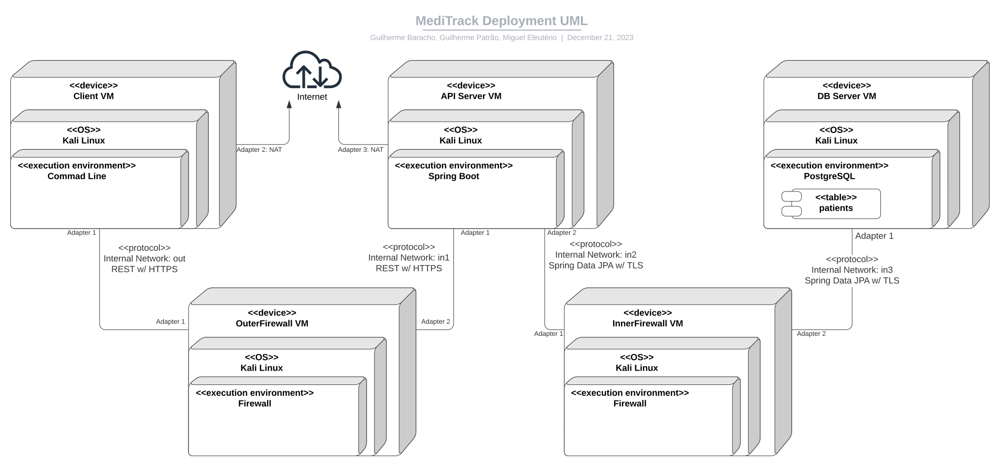

# A06 MediTrack Project Report

## 1. Introduction

Our project, MediTrack, is set in a medical environment, where both doctors and patients must be able to communicate with the system keeping
the confidentiality of sensible patient information, as well as the authenticity of the records registered by the doctors. In order to achieve this, we 
created a library that implements 3 major functionalities that can be used on the command-line, as well as a multitude of methods that can be imported
to code projects.
The 3 major functionalities are separated in 3 classes:
- Protect -> Receives a JSON input-file, encrypts it and generates an encrypted JSON output-file.
- Unprotect -> Receives an encrypted JSON input-file, decrypts it and generates the original JSON file.
- Check -> Receives an encrypted JSON input-file and verifies if the integrity of the encryption has been compromised or not.
We'll delve deeper into the details of the implementation in the **Secure Document Format** section of this report.

Our general infrastructure consists of the client application, running on an arbitrary user's computer and environment, the application server, 
running in a semi-controlled environment, a so called DMZ, and, finally, the database, running in a controlled and secure environment. The user connects to the application
server, which then communicates to the database to perform the operations as needed and then responds back to the client.

The security challenge was an extra challenge imposed to our system that we had to adjust to, fortunately or not, we were not very deep into the
project when it released, so some of our ideas and implementation already had that in mind and we were able to adjust to it rather well.



## 2. Project Development

### 2.1. Secure Document Format

#### 2.1.1. Design

The library, as said before, consists of 3 main functionalities, *Protect*, *Unprotect* and *Check*, which, respectively, are responsbile for ciphering 
a document, deciphering a document or verifying the integrity of a ciphered document. 

The full usage of the library is as follows:
```sh
protect <input-file> <output-file> <client>
unprotect <input-file> <output-file> <client>
check <input-file> <client>
```
Since the scope of the library was very specific, there was no need to accomodate for a lot of variety in the inputs and outputs, since we knew 
our library would be working with JSONs in a specific format, which allowed us to not only write simpler code, but more compact JSONs. 
The *client* argument should refer to the name of the document's owner and is needed for operations that require the usage of a 
specific key, as well a specific scenario in *Protect* explained later in this section. There is no real enforcement that the 
person executing *Protect* is actually the owner, but such person must possess the actual owner's private key in order to decrypt his data,
which is secure under normal circumstances. A regular file in this system is divided into sections (explained in **Security Challenge**), each one 
containing *contents* and *metadata*. The *contents* will either be encrypted with symmetric encryption and encoded in a Base64 String or will be
present in their real format. The *metadata* contains valuable information to whoever is trying to encrypt ou decrypt the *contents*, since
it has the *key* and *IV* encrypted with the associated *client*'s public key that, obviously, when using his private key, 
can decrypt the *key* and *IV* fields to obtain the data that was/should be used for the symmetric encryption.
The package used for JSON handling throughout this project was *com.google.gson* so any mention to e.g. JsonObject refer to that package's object.

Finally, these are the formats of the JSONs that the library uses:

- *Protect*, *Unprotect* & *Check* input-file format -> As mentioned, *Protect*, *Unprotect* && *Check* receive a JSON separated in sections. 
The difference, in terms of format, is that *Protect* can deal with empty *metadata* fields, while *Unprotect* and *Check* cannot. 
This will later be explained in the **Implementation** section. All 3 accept JsonObject, JsonArray and a String as the type for *contents*, 
but *Protect* will only work on sections with a JsonObject or a JsonArray, while *Unprotect* and *Check* will only work on sections with a String.
The following example is not a real one, due to implementation nuances, but it serves to identify the differences. Either section will work for any
command, but *Check* and *Unprotect* will ignore "section 1", while *Protect* will ignore "section 2". Besides this, "section 1"'s *metadata* is OK
for *Protect*, but *Unprotect* and *Check* will not be able to function on said section, ignoring it as well.

```json
{
  "section 1": {
    "contents": {
        "arbitratry JSON, can be a JsonObject or a JsonArray.."
    },
    "metadata": [
    ]
  },
  "section 2": {
    "contents": "This is a Base64 string",
    "metadata": [ 
        {
         "client": "client name",
         "key": "symmetric key to encrypt contents, encrypted with client's public key",
         "IV": "IV to encrypt contents, encrypted with client's public key"
        },
        {
         "client": "same as before...",
         "key": "same as before...",
         "IV": "same as before..."
        }
    ]
  }
}
```

- *Protect* & *Unprotect* output-file format -> Both give back a JSON with the opposite of what they accept in terms of *contents*. 
*Unprotect* will return a JSON, whose sections' *contents* are all either JsonArray or JsonObject, unless it failed to decrypt a section, 
which results in it not changing, while *Protect* will return a JSON, whose sections' *contents* are all Strings, all encoded in Base64, 
if there weren't any non-Base64 strings in the input (which should not be the case). As for *metadata*, *Protect*'s files will always have
a JsonArray with 1 or more entries, while *Unprotect* will keep the same number of entries as the ones it received. As an example, we can use the previous
one with different logic. This time, "section 1"'s *contents* may only have been generated by *Unprotect*, while "section 2" can either be a functional
*Protect* or an *Unprotect* without permission to decrypt (aka the client doesn't have its name on the section's *metadata*). As for the *metadata*, 
"section 1"'s can only be a product of *Unprotect*, since *Protect* will always have at least 1 entry and "section 2"'s can be a product of both.

```json
{
  "section 1": {
    "contents": {
        "arbitratry JSON, can be a JsonObject or a JsonArray.."
    },
    "metadata": [
    ]
  },
  "section 2": {
    "contents": "This is a Base64 string",
    "metadata": [ 
        {
         "client": "client name",
         "key": "symmetric key to encrypt contents, encrypted with client's public key in base64",
         "IV": "IV to encrypt contents, encrypted with client's public key in base64"
        },
        {
         "client": "same as before...",
         "key": "same as before...",
         "IV": "same as before..."
        }
    ]
  }
}
```

Check has no output-file as it only prints "OK" or gives an error, based on the quality of the integrity in each section's encryption.

#### 2.1.2. Implementation

This library was implemented in Java, more specifically, Java 8. It should be noted that, while existing as a CLI, this was never
used directly when developing the real application and, therefore, might be prone to more issues. As for the real usage of this library,
throughout the entire ecosystem of MediTrack, this was done via Java imports and each classes direct methods.

As mentioned, JSON handling was done using "com.google.gson". Encryption and decryption was done using "javax.crypto". Key handling was done
using "java.security".

Starting with *Protect*, we developed a simple ```byte[] encrypt(byte[] toEncrypt, byte[] key, byte[] IV)``` method able to 
encrypt any byte array, using "AES/GCM". The decision to use "AES" was due to its renown as a reliable and secure algorithm, 
being approved by NIST. "GCM" followed a similiar process of choice, since it's recommended by NIST as the go-to "AES" mode and it also ensures
the integrity of the encrypted contents.

We then expanded on our *encrypt* method to create ```encryptJSON(JsonObject json, String client, String patient)```, able to encrypt an entire 
JSON file with the format described above: divided by sections, which contain *contents* and *metadata*.
We can now expand on the details of this implementantion:

This method will look for every initial field in the JSON and read it as a section, meaning it assumes it will contain a *contents* and a *metadata* field.
The *contents* can realistically be any JsonObject, JsonArray or String, where the presence of a String in this field causes the section to be ignored, 
since it will be counted as already decrypted previously, while the *metadata* must always be a JsonArray, containing 0 or more JsonObject. 
Each JsonObject in the *metadata* is a three-way-group including a *client* (name), a *key* and an *IV*, where both the *key* and the *IV* are 
the data that should be used to symmetrically encrypt the corresponding *contents* and, obviously, since they are private data, they are asymmetrically 
encrypted with the *client* public key so that only they can decrypt the *key*, *IV* and, consequently, the *contents*. Taking this into account,
we must look through the *metadata* of every section for the *client* given as an argument, which relates to who is encrypting the data. If the client
is not found at **any** section, the method will not continue the encryption, since leaving any data unprotected is not safe. If we find the client,
we can get his private key, that we must have, in order to decrypt the symmetric key and IV, to then use them both to get the original *contents*.
As mentioned, *metadata* may be empty and, in this scenario, our method will generate a *key*, using "java.crypto.KeyGenerator" and "java.security.SecureRandom", and an *IV*, using "java.security.SecureRandom", to symmetrically encrypt the *contents* of the section. Afterwards, it will asymmetrically 
encrypt the *key* and the *IV* with 2 public keys: "emergency"'s and a patient's, appending this result to the *metadata* of the section. 
The patient refers to the given as an argument, who should be the owner of the document, who should, obviously, always have access to his own records by default
and "emergency" is the system's "omniscient" entity that can be used to cipher or decipher anything in the case of emergency or for mandatory 
needs when handling the documents. 
The realistic usage of this method is in the application under the call encryptJSON(json, "emergency", docOwner), since, in our architecture, 
the application is the one responsible for encrypthing the data.
Note: The asymmetric encryption used here comes as a direct consequence of the security challenge's needs and it should also be noted that, 
even if there are multiple entries in *metadata* for the same section, they all contain the same *key* and *IV*, 
they are simply encrypted with a different public key.

As for *Unprotect*, we developed the opposite side of things with ```decrypt(byte[] toDecrypt, byte[] key, byte[] IV)``` and 
```decryptJSON(JsonObject json, String client)```. The method will work similarly with a few differences: the presence of a String means that the
field is yet to be decrypted, which allows us to continue, while the presence of another JsonElement means that it's decrypted already and we can
ignore it. Unlike in the encryption function, *metadata* cannot be empty, since we must know the keys used for encrpytion, however, 
decryption allows for certain sections to be skipped, as this doesn't mean that any security may be compromised.
In fact, this is expected behavior e.g. when a doctor tries to read the data of a patient without having access to the entirety to it, he should
only be able to read certain sections. Similarly to encryption, we also use the "emergency" entity when decrypting files in the application server, however,
this cannot be done in the client application, since the clients ~~shouldn't~~ don't have the "emergency" private key.

Due to the nature of our application, we never actually use *Check*. For reporting purposes, it is exactly the same as *Unprotect*, but doesn't return
the decrypted contents, only returning a message stating whether it was able to decrypt the *contents* of each section or not. No additional
checking is needed, due to the nature of GCM that inherently verifies integrity when decrypting.

There were a few challenges in this section:
- We had difficulty establishing the baseline for the JSON format and, ultimately, we had to commit to certain aspects, such as a relatively hard-coded
format, due to too many variables that could be present. Realistically, this is not a severe issue, since most of the library's calls
are made by the application we control, but, due to limitations in time and testing there is still a lot of room for badly-formatted 
JSONs that may cause issues in the system.
- We had difficulty managing all the different keys that were implicated in the process of encryption and decryption, while keeping the 
data secure from external attackers. Ultimately, this was solved by iterating over a piece of paper and establishing a clear process of encryption and
decryption.
- We had difficulty conciliating the application's operations with the library, since we want the application to be able to make operations
over the documents. This raises the concern of how the library should have access to such options, since the contents will be encrypted, which
led us to the "emergency" key being used for application operations, that may not be ideal to a patient with a liberalist point of view regarding confidentiality, since we're accessing their data.

### 2.2. Infrastructure

#### 2.2.1. Network and Machine Setup

The infrastructure consists of 5 different machines: Client, API, DataBase and two Firewalls.

The addition of the firewalls was done to isolate the information on various levels.

We used both Spring Boot and PostgreSQL before, so we decided to use them again as we already had some experience.

#### 2.2.2. Server Communication Security

As mentioned, communication exists in two locations: Client<->Server and Server<->Database.

Communication between the client application and the server is done via HTTPS, using a self-signed certificate generated by the server before-hand.
In order to prevent man-in-the-middle attacks, we did not disable the check for self-signed certificates, we directly import the certificate from the
file system and handle it in Java. However, this doesn't come without disadvantages, since we must place this certificate somewhere in the client's PC. 
We must note the fact that, in development, we could have a real signed certificate and things would be more simple. In order to prevent repeat attacks,
each request from the client comes with a UUID and, in order to prevent an attacker from impersonating a user and generating his own messages, each request's hash is computed
and encrypted with the client's private key, signing the request, which is then verified by the server.
We decided to use a UUID, since it's effectively "fool-proof" and, in our situation, didn't really present many cons, since it's a closed network, with
a limited amount of traffic.

Communication between the server and the database is handled by Spring-Boot’s own mechanism for interacting with PostgreSQL databases. The connection is made through an SSL connection using the TLSv1.3 protocol and TLS_AES_256_GCM_SHA384 cipher, activated in the database config files set in the machine’s setup. Adding to the protected channel, all the documents exchanged between the server and the database are previously encrypted inside the server and stay encrypted through their communication and handling by the database.

The communications between machines are always done through firewalls. All communications from the client are directed at a firewall machine that then routes the packets to the API and the same from the API to the database. Both firewalls only allow the specific types of communications used by those services.

At boot time, each client has its own private key, the public keys of every client that exists in the ecosystem, including "emergency", and the previously
mentioned certificate for HTTPS. 

The application's private key is "emergency".

In order to address the emergency situation presented in the **Security Challenge**, all the doctors in the system also have access to the
"emergency" private key, however, it is not standard behavior for them to use it and this will be discussed further in said section.

These keys are initially generated via a script and then must be placed manually on each client's PC. The private key must be extracted from a
script according to who is using the PC, as a comparison to real life's hospital cards, for example. The existance of all private keys in a system
would be deprecated in a production environment for security purposes and is only used in development for testing purposes.

### 2.3. Security Challenge

#### 2.3.1. Challenge Overview

The security challenge required our application to sign each consultation record by a doctor in a non-repudiable way, while also
requiring us to implement controlled sharing, which should allow patients to explicitly declare who can access their private data.

As for the signing, we already had each request signed by the sender, so we simply had to sign the consultation record itself when registering it
as a doctor, which was relatively simple. 

As for the controlled sharing, it was a bit more complicated, since, initially, we were going 
to send the entire documents, assuming each doctor could read it all, which then forced us to divise sections that the 
patient could control that were actually relevant, while also making sure that each doctor only had access to the keys that he should have access to.
For the section divising, we set on "speciality", since it isn't as specific as every consultation, but it also isn't as general as doctor X can or not 
read the entire document.

#### 2.3.2. Attacker Model

A fully trusted attacker would be e.g. a doctor, which, in the current system, could abuse the emergency setting to read the data from any patient. This could be fixed or at least mitigated by adding some kind of logging system for requests using the emergency key, making it possible to make the ones who use it without reason accountable.

He could also add fake consultation records, but this would not compromise the security of the system. A possible fix would be requiring the approval of the user
to register the consultation.

Even worse, would be an attacker that gained power over the application server, where sensitive data passes through and has the ability to
completely decrypt and manage it. In this situation, the attacker would have full control over what's going on and could do virtually anything.

An attacker that gains control over a patient account is limited to damaging the user itself, not the system's security.

#### 2.3.3. Solution Design and Implementation

As mentioned, the signing was as simple as generating a signature of the consultation upon its creation in the client application, which would
then be verified by the server, using the doctor's public key and the consultation sent and, if verified, it would append it to the already created
consultation. Verifying the signature at any time simply requires removing it from the consultation, computing the SHA256 hash of the consultation, decrypt the signature
using the doctor's public key and comparing the hashes.

As for the controlled sharing, we had to implement what we mentioned in previous sections. We divided each document in sections, allowing the user to grant or
revoke access of a doctor to a specific section of his document with all access revoked by default. Granting access to a new doctor is trivial, we simply
decrypt the contents from the "emergency" entry of the *metadata* in the server and encrypt it with the doctor's public key, allowing him to find his entry
when trying to read and decrypt the document. However, revoking access requires extra work, since even if we remove a doctor's entry from the *metadata*, if
we assume it had been stored previously, such key can simply be retrieved and used as if nothing had happened. Thus, we must regenerate the key for the 
entire section and update the remaining doctor's entries accordingly, ensuring that, even if the removed doctor held their key, it no longer serves
any purpose. For future reference, we could also expand this control to the maximum e.g. the user can select that only he can fully decrypt his data, 
not allowing the server to read it at all.

As for the emergency setting, we implemented a direct flag in the client app "--emergency", but, in reality, we could implement a system that requires the
cooperation of at least another doctor to prevent a lone malicious attacker. We could also additionally add a log in our server, that would log
every doctor that used such flag, so we could check if there were any misuses of such setting. Since, time was a constraint, such thing was not
implemented, but it would be a good thing to do in a future update.

We're also aware of some missing QoL features that could be added, such as the client knowing who has permissions to read a specific section at the moment 
or having a way of seeing all the doctors registered in the system over manually knowing them. It's also a limitation of the implementation that
users cannot have names that are composed of two names.

The client application communicates with the server application changing the following messages:

Client -> Server
https://ip:port/read - POST:
```json
{
  "command": "read",
  "info": {
    "sender": "UserName",
    "patient": "PatientName"
  }, 
  "uuid": "UUID",
  "signature": "Base64Signature"
}
```
Server -> Client
Response:
```json
{
"section 1": {
    "contents": "This is a Base64 string",
    "metadata": [ 
        {
         "client": "client name",
         "key": "symmetric key to encrypt contents, encrypted with client's public key in base64",
         "IV": "IV to encrypt contents, encrypted with client's public key in base64"
        },
        {
         "client": "same as before...",
         "key": "same as before...",
         "IV": "same as before..."
        }
    ]
  }
}
```
OR
```
ERROR: error message
```
Client -> Server
https://ip:port/register - POST:

```json
{
  "command": "register",
  "info": {
    "sender": "UserName",
    "patient": "PatientName",
    "consultation": {
      "date": "2022-05-13",
      "speciality": "Dermathology",
      "doctor": "UserName",
      "practice": "Clinic",
      "summary": "Prescribed some cream",
    },
    "consultationSignature": "Base64SignatureOfConsultation"
  },
  "uuid": "uuid", 
  "signature": "Base64Signature"
}
```
Server -> Client
Resposta:
```
OK
```
OR
```
ERROR: error message
```
Client -> Server
https://ip:port/change - PUT:
```json
{
  "command": "change",
  "info": {
    "sender": "UserName",
    "doctor": "DoctorName",
    "action": "grant/revoke",
    "sections": [
      "Dermathology"
    ]
  },
  "uuid": "uuid",  
 "signature": "Base64Signature"
}
```
Server -> Client
Response:
```
OK
```
OR
```
ERROR: error message
```

## 3. Conclusion

In this project, we managed to create a fully functional project basically from scratch, including the infrastructure, network setup, 
how communication is handled, how the data should be stored and various concerns regarding security.

We believe we satisfied almost all the main requirements since our system is able to implement a secure document format (by encrypting and 
decryting the files as needed), we were able to design a basic infrastructure that can emulate a real world deployment scenario, and we 
were also able to respond to the security challenge, by having a non-repudiable signature and controlled sharing, including the emergency 
situation. We are also aware that the project could use a lot more refining in other areas, but taking into account the time constraints that were 
present, we are glad we could make a project that worked well in the end.

Finally, we would like to thank the teaching team for providing us with a good learning environment by being open to answering any questions we may have had,
taking the first step in providing us feedback. We, as a group, have gained a lot of hands-on experience on subjects that we had never touched before, such
as setting up an infrastructure and a network or creating and using certificates for HTTPS.

----
END OF REPORT
